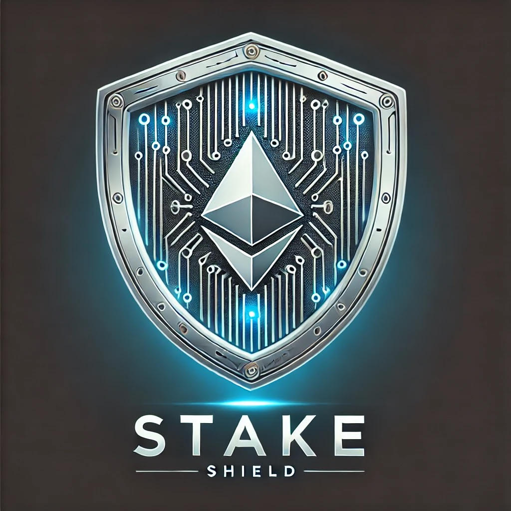
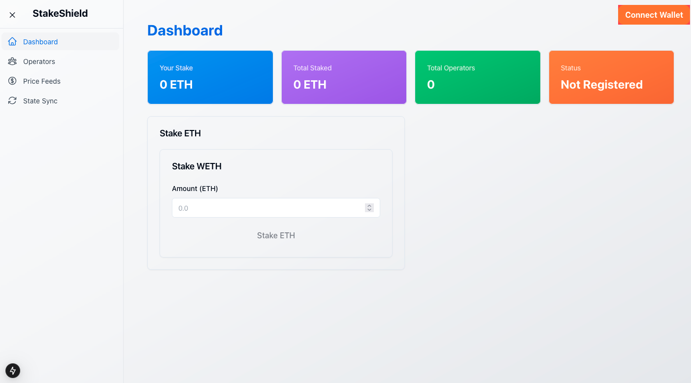
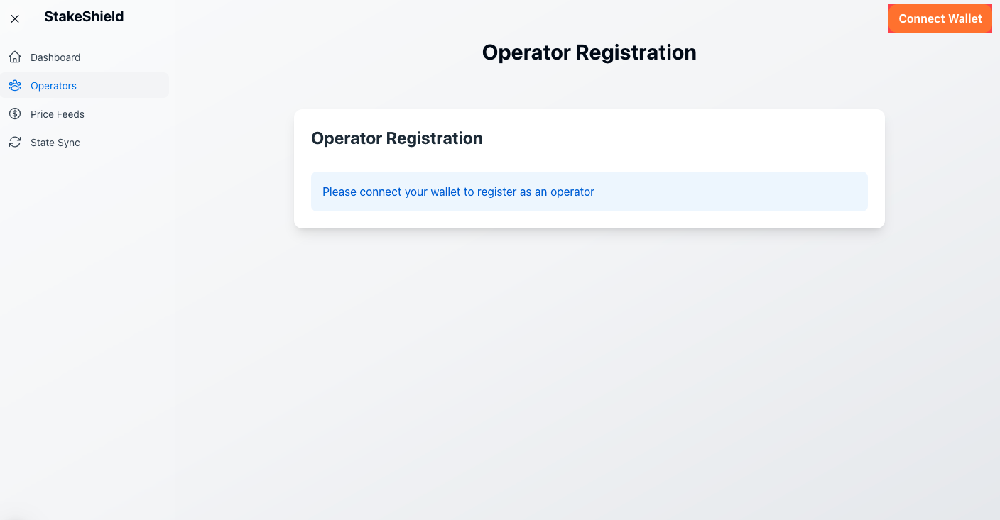
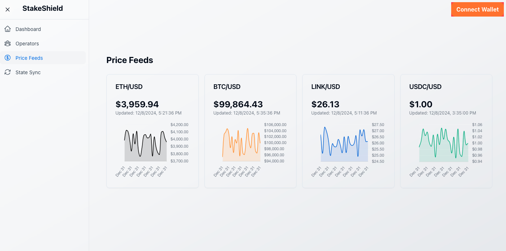
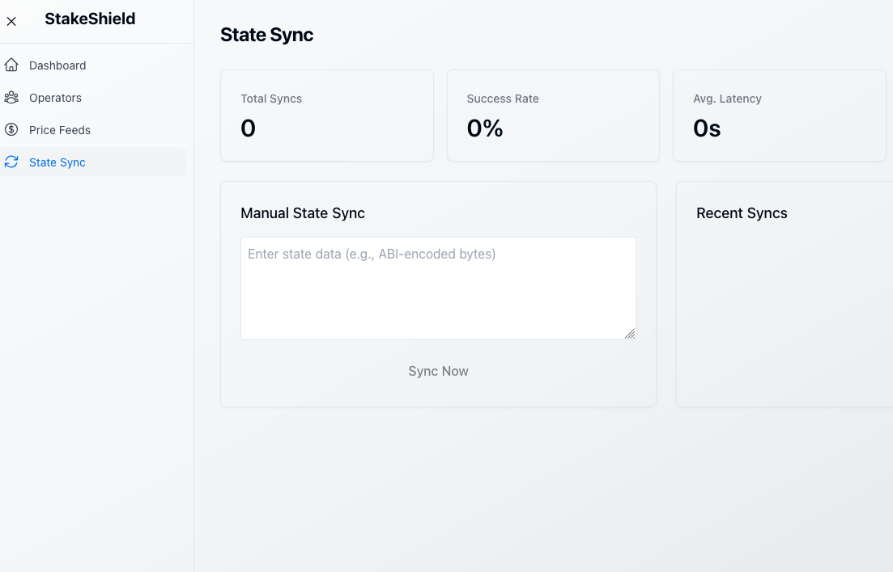

<p align="center">
  
</p>

<h1 align="center">StakeShield</h1>

<p align="center">
A Uniswap v4 hook with complete frontend and backend infrastructure for interacting with EigenLayer's Protected AVS contracts on Holesky testnet.
</p>

## Development Status

🟢 **Fully Functional:**
- Smart Contract Integration with EigenLayer
- Operator Registration
- Frontend Wallet Connection
- Dashboard UI

🟡 **In Development:**
- Backend Services
- Price Feed Integration
- State Sync Functionality
- Real-time WebSocket Updates
- Historical Data API
- Operator Metrics Collection

⚠️ **Note:** This project is under active development. Some features shown in the interface are currently placeholder implementations and will be functional in future releases.

## Overview
This project provides a complete infrastructure for interacting with EigenLayer's Protected AVS contracts, including smart contract hooks, user-friendly frontend, and a robust backend service.

## Frontend Interface

### Dashboard

*Main dashboard interface showing key metrics and status*

### Operators

*Operator registration and management interface*

### Price Feeds

*Real-time price feed monitoring and configuration*

### State Sync

*State synchronization status and controls*

## Features
- Register as an operator
- Stake WETH
- View operator stats and stake history
- Real-time updates for operator registration events
- Error handling for contract interactions
- Complete frontend dashboard
- Price feed integration
- State synchronization monitoring
- Wallet integration with RainbowKit
- Backend API endpoints for data access
- WebSocket support for real-time updates

## Installation

### Smart Contract Setup

1. Install dependencies:
```bash
yarn install
```

2. Set up environment:
```bash
cp .env.example .env
# Fill in required values
```

3. Start all services:
```bash
chmod +x scripts/start.sh
./scripts/start.sh
```

### Frontend Setup

1. Navigate to frontend directory:
```bash
cd frontend
```

2. Install dependencies:
```bash
npm install
```

3. Create `.env.local`:
```
NEXT_PUBLIC_WALLET_CONNECT_PROJECT_ID=your_project_id
```

4. Start development server:
```bash
npm run dev
```

### Backend Setup

1. Navigate to backend directory:
```bash
cd backend
```

2. Install dependencies:
```bash
npm install
```

3. Configure environment:
```bash
cp .env.example .env
# Fill in required values:
# - Database connection
# - RPC endpoints
# - API keys
```

4. Start the backend service:
```bash
npm run start
```

## Deployment

### Local Testing
```bash
forge script script/Deploy.local.s.sol
```

### Testnet (Holesky)
```bash
forge script script/EigenProtectedAVSHook.s.sol --rpc-url $HOLESKY_RPC_URL --broadcast --verify
```

### Mainnet
```bash
forge script script/deploy/DeployMainnet.s.sol --rpc-url $MAINNET_RPC_URL --broadcast --verify
```

## Contributing

1. Fork the repository
2. Create your feature branch (`git checkout -b feature/amazing-feature`)
3. Commit your changes (`git commit -m 'Add some amazing feature'`)
4. Push to the branch (`git push origin feature/amazing-feature`)
5. Open a Pull Request